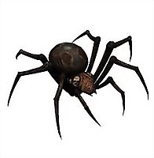

# bem-site-crawler
Simple page crawler for bem-site-projects

[](http://www.npmjs.org/package/bem-site-crawler)
[](https://coveralls.io/r/bem-site/bem-site-crawler?branch=master)
[](https://travis-ci.org/bem-site/bem-site-crawler)
[](https://david-dm.org/bem-site/bem-site-crawler)
[](https://david-dm.org/bem-site/bem-site-crawler#info=devDependencies)



## Установка

Пакет устанавливается как обычная npm зависимость
```
$ npm install --save bem-site-crawler
```

## Тестирование

Запуск тестов с вычислением покрытия кода тестами с помощью инструмента [istanbul](https://www.npmjs.com/package/istanbul):
```
npm test
```

Проверка синтаксиса кода с помощью: 
[jshint](https://www.npmjs.com/package/jshint),
[jscs](https://www.npmjs.com/package/jscs)

```
npm run codestyle
```

Особая благодарность за помощь в разработке:

* Ильченко Николай (http://github.com/tavriaforever)
* Константинова Гела (http://github.com/gela-d)
* Гриненко Владимир (http://github.com/tadatuta)
* Абрамов Андрей (https://github.com/blond)

Разработчик Кузнецов Андрей Серргеевич @tormozz48
Вопросы и предложения присылать по адресу: tormozz48@gmail.com
